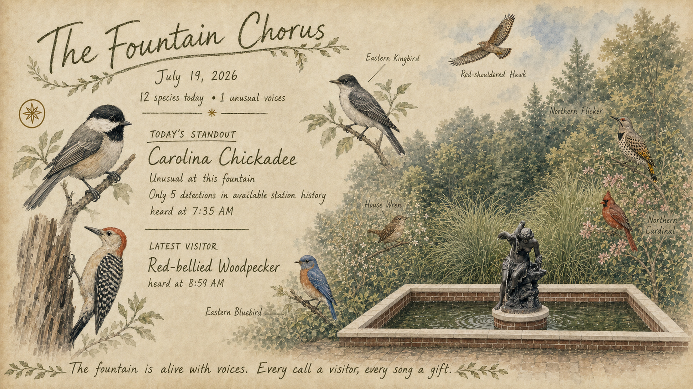

# BirdArt for Samsung Frame

BirdArt turns BirdWeather station activity into ambient artwork for a Samsung
Frame TV.



*Example output: live bird detections interpreted as a handwritten watercolor
field journal for the Frame TV.*

## Privacy-first setup

The repository contains reusable templates, prompts, documentation, source code,
and the curated example above. Live station settings, TV network identifiers,
reference photographs, raw detections, occurrence history, API credentials, and
generated artwork remain local through `.gitignore`.

```bash
cp data_input/station.example.json data_input/station.json
cp data_input/frame.example.json data_input/frame.json
```

Edit those private files, then place `fountain.png` and `sample_update.png` in
`images_input/`. The latter is an optional style/composition reference.

BirdArt supports Python 3.11+ on macOS and Linux:

```bash
python3 -m venv .venv
.venv/bin/pip install -r requirements-lock.txt
```

## End-to-end workflow

1. Query recent activity and station history:

   ```bash
   .venv/bin/python src/birdweather_history.py --days 1 --output-dir data_output
   .venv/bin/python src/birdweather_history.py --days 90 --output-dir data_output
   ```

2. Resolve today's date and current station values into the reusable prompt:

   ```bash
   .venv/bin/python src/build_artwork_prompt.py
   ```

   The builder reads the station ID from `data_input/station.json`, balances
   standout exposure by occurrence tier, and uses station rarity as a
   tie-breaker. It refuses rarity claims if pagination stops early or reaches
   the configured retrieval limit. API totals remain informational because
   BirdWeather can calculate them differently from confidence-filtered nodes.

3. Generate artwork with the OpenAI Image API:

   ```bash
   export OPENAI_API_KEY="your-api-key"
   .venv/bin/python src/generate_artwork.py \
     --reference images_input/fountain.png \
     --reference images_input/sample_update.png \
     --output images_output/generated_artwork.png
   ```

   The generator uses GPT Image 2 by default and accepts repeated references.
   API usage can incur charges. Inspect the image before publishing because
   image models can still introduce visual or typesetting errors.

4. Optionally prepare an exact 4K 16:9 JPEG for inspection:

   ```bash
   .venv/bin/python src/frame_publish.py \
     --image images_output/generated_artwork.png --prepare-only
   ```

5. Prepare, publish, and verify the accepted source image:

   ```bash
   .venv/bin/python src/frame_publish.py \
     --image images_output/generated_artwork.png
   ```

   The TV and computer must share a network. Publishing uploads exactly once,
   retries selection separately, and verifies the current content ID. Previous
   artwork is retained. Frame host, MAC, broadcast address, retry settings, and
   matte belong in private `data_input/frame.json`.

6. Only after a verified publish, record the selected birds:

   ```bash
   .venv/bin/python src/record_featured_history.py --content-id MY_F0001
   ```

For a reversible display test that restores the previous image, use
`scripts/preview_on_frame.py`. To inspect the current selection, use
`scripts/show_frame_status.py`.

## Scheduling

The committed `scripts/run_pipeline.sh` runs the workflow from the repository
root, stops on its first failure, and records history only after a verified
publish. Schedule it with the operating system's task scheduler at
`0 6,9,17,21 * * *`. Its private
environment should contain `OPENAI_API_KEY`, `PATH`, and the absolute repository
path. The computer must be awake and on the Frame's network.

```cron
0 6,9,17,21 * * * /absolute/path/to/birdart/scripts/run_pipeline.sh
```

## Running with Codex

Codex can run the queries, resolve the prompt, generate or review the artwork,
publish it, and configure a recurring automation. See
[`docs/running-with-codex.md`](docs/running-with-codex.md) for setup, reusable
prompts, approval boundaries, and verification guidance.

## Development

```bash
.venv/bin/pip install -r requirements-dev.txt
.venv/bin/python -m ruff check src scripts tests
.venv/bin/python -m unittest discover -s tests -v
```

CI runs lint and unit tests on every push and pull request. The project is
distributed under the MIT License.

## Before publishing to GitHub

```bash
git status --short --ignored
git check-ignore -v data_input/station.json data_input/frame.json \
  images_input/fountain.png data_output images_output
```

Do not force-add ignored files. If private files were committed elsewhere,
`.gitignore` cannot remove them from history; purge that history and rotate any
exposed credentials before publishing.
